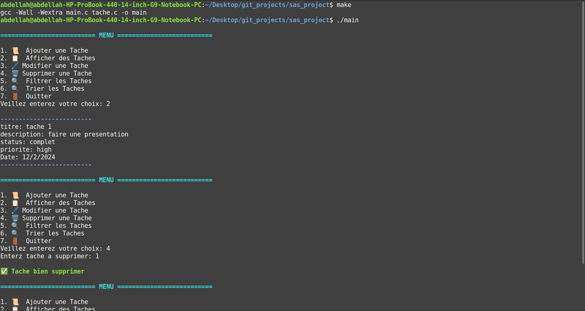

# Task Management


## Images


## Description
This project is a task management application that allows users to add, edit, display, and delete tasks.
Task information is stored in a text file.

## Features
- Add a task with a title, description, status, priority, and date.
- Display all tasks.
- Edit the information of an existing task.
- Delete a task.
- Filter tasks by title, status, priority, and date.
- Sort task in ascending/descending order with data

## How To Use

``` bash
make
./main
```

## Contribute

```bash
https://github.com/KaraniAbdellah/sas_project.git
cd sas_project
```


made with love by <a href="https://www.linkedin.com/in/abdellah-karani-965928294/" target="_blank">abdellah karani</a>

